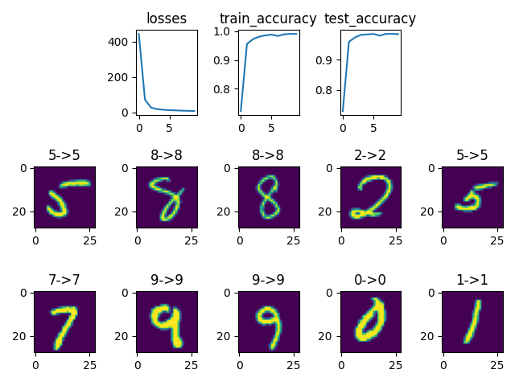

# L10_11 编程作业
    自实1901班 黄子昊 U201914549
## 1. IRIS数据集

+ 神经网络代码
  
```python
import torch


class Net(torch.nn.Module):
    def __init__(self, n_feature, n_hidden, n_output):
        super(Net, self).__init__()
        self.hidden = torch.nn.Linear(n_feature, n_hidden)
        self.out = torch.nn.Linear(n_hidden, n_output)

    def forward(self, x):
        x = torch.relu(self.hidden(x))
        x = self.out(x)
        return x
```

+ 测试代码

```python
import csv
import torch
from lib.BPNet import *

epochs = 1000
lr = 0.05
batch_size = 1

flower_map = {
    "setosa": 0,
    "versicolor": 1,
    "virginica": 2
}


def readcsv(files):
    csvfile = open(files, 'r')
    plots = csv.reader(csvfile, delimiter=',')  # 按行读取CSV文件中的数据,每一行以空格作为分隔符，再将内容保存成列表的形式
    next(plots)  # 读取首行
    x = []
    y = []
    for row in plots:
        x.append([float(row[1]), float(row[2]), float(row[3]), float(row[4])])
        y.append(flower_map[row[5]])
    return torch.tensor(x), torch.tensor(y)


train_x, train_y = readcsv("../data/Iris/iris_train.csv")
test_x, test_y = readcsv("../data/Iris/iris_test.csv")

train_loader = torch.utils.data.DataLoader(dataset=torch.utils.data.TensorDataset(train_x, train_y),
                                           batch_size=batch_size,
                                           shuffle=True, drop_last=True)

test_loader = torch.utils.data.DataLoader(dataset=torch.utils.data.TensorDataset(test_x, test_y),
                                          batch_size=batch_size,
                                          shuffle=True, drop_last=True)

net = Net(n_feature=4, n_hidden=20, n_output=3)
optimizer = torch.optim.SGD(net.parameters(), lr=lr)
loss_func = torch.nn.CrossEntropyLoss()

for epoch in range(epochs):
    for batch_idx, (data, label) in enumerate(train_loader):
        optimizer.zero_grad()
        out = net(data)
        loss = loss_func(out, label)
        loss.backward()
        optimizer.step()

correct = 0
for data, target in test_loader:
    out = net(data)
    prediction = torch.max(out, 1)[1]
    pred_y = prediction.data.numpy()
    target_y = target.data.numpy()
    if target_y == pred_y:
        correct += 1
accuracy = correct / len(test_loader)
print("Accuracy: ", accuracy)

```

+ 分类结果
  
```
Accuracy:  0.9833333333333333
```

    正确率为98.3%
+ 讨论

    + 当隐含层增加一层时
        
        Accuracy: 0.6833333333333333

        正确率不增反降，可能是出现了梯度消失现象

    + 当学习率增大10倍时
    
        Accuracy:  0.3333333333333333

        未得到学习，说明发生了严重的震荡现象
        
    + 当学习率缩小10倍时
    
        Accuracy:  0.9833333333333333

        效果一致

      + 当隐含层节点数增多至128时
    
        Accuracy:  0.9666666666666667

        略有下降

      + 当改用sigmoid激活函数时
    
        Accuracy:  0.95

        略有下降

## 2. LeNet

+ 神经网络代码

```python
import torch.nn as nn


class LeNet(nn.Module):
    def __init__(self):
        super(LeNet, self).__init__()
        self.conv1 = nn.Sequential(  # input_size=(1*28*28)
            nn.Conv2d(in_channels=1, out_channels=6, kernel_size=5, stride=1, padding=2),
            nn.Sigmoid(),
            nn.AvgPool2d(kernel_size=2, stride=2)  # output_size=(6*14*14)
        )
        self.conv2 = nn.Sequential(
            nn.Conv2d(in_channels=6, out_channels=16, kernel_size=5, stride=1, padding=0),
            nn.Sigmoid(),  # input_size=(16*10*10)
            nn.AvgPool2d(kernel_size=2, stride=2)  # output_size=(16*5*5)
        )
        self.flatten = nn.Flatten()
        self.fc1 = nn.Sequential(
            nn.Linear(16 * 5 * 5, 120),
            nn.Sigmoid()
        )
        self.fc2 = nn.Sequential(
            nn.Linear(120, 84),
            nn.Sigmoid()
        )
        self.fc3 = nn.Linear(84, 10)

    def forward(self, x):
        x = self.conv1(x)
        x = self.conv2(x)
        x = self.flatten(x)
        x = self.fc1(x)
        x = self.fc2(x)
        x = self.fc3(x)
        return x
```

+ 测试代码

```python
import torch
import torchvision as tv
import matplotlib.pyplot as plt
import numpy as np
from lib.LeNet import *

epochs = 10
batch_size = 256
lr = 0.01
device = torch.device("cuda" if torch.cuda.is_available() else "cpu")

trainset = tv.datasets.MNIST(
    root='../data/',
    train=True,
    download=True,
    transform=tv.transforms.ToTensor())
trainloader = torch.utils.data.DataLoader(
    trainset,
    batch_size=batch_size,
    shuffle=True,
)
testset = tv.datasets.MNIST(
    root='../data/',
    train=False,
    download=True,
    transform=tv.transforms.ToTensor())
testloader = torch.utils.data.DataLoader(
    testset,
    batch_size=batch_size,
    shuffle=False,
)

net = LeNet().to(device)
criterion = nn.CrossEntropyLoss()
optimizer = torch.optim.Adam(net.parameters(), lr=lr)


def test(data_loader):
    with torch.no_grad():
        correct = 0
        total = 0

        for images, labels in data_loader:
            images, labels = images.to(device), labels.to(device)
            outputs = net(images)
            predicted = np.argmax(outputs.cpu().detach().numpy(), axis=1)
            total += labels.size(0)
            correct += (torch.tensor(predicted) == labels.cpu()).sum()
        return correct.item() / total


if __name__ == "__main__":
    losses = []
    train_accuracy = []
    test_accuracy = []
    for epoch in range(epochs):
        sum_loss = 0.0

        for i, (inputs, labels) in enumerate(trainloader):
            inputs, labels = inputs.to(device), labels.to(device)

            optimizer.zero_grad()
            outputs = net(inputs)
            loss = criterion(outputs, labels)
            loss.backward()
            optimizer.step()

            sum_loss += loss.item()

        losses.append(sum_loss)
        train_accuracy.append(test(trainloader))
        test_accuracy.append(test(testloader))

    plt.xlabel("epochs")
    plt.subplot(3, 5, 2)
    plt.title("losses")
    plt.plot(losses)
    plt.subplot(3, 5, 3)
    plt.title("train_accuracy")
    plt.plot(train_accuracy)
    plt.subplot(3, 5, 4)
    plt.title("test_accuracy")
    plt.plot(test_accuracy)

    evalloader = torch.utils.data.DataLoader(
        testset,
        batch_size=1,
        shuffle=True,
    )
    with torch.no_grad():
        i = 0
        for images, labels in evalloader:
            images, labels = images.to(device), labels.to(device)
            i += 1
            if i > 10:
                break
            pred = net(images)
            pred = np.argmax(pred.cpu().detach().numpy())
            plt.subplot(3, 5, i + 5)
            plt.title("{}->{}".format(labels.cpu().item(), pred))
            plt.imshow(images.cpu().view(28, 28))
    plt.show()

```

+ 分类结果


