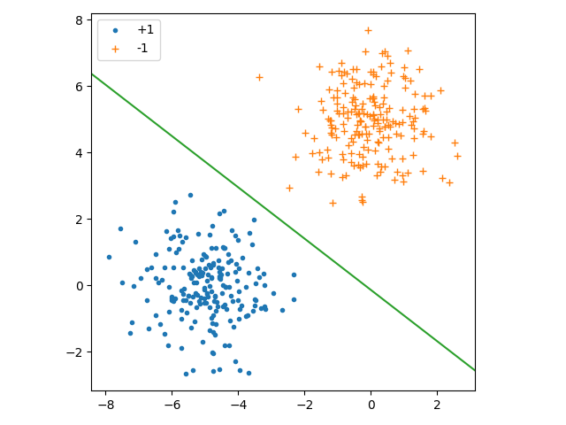
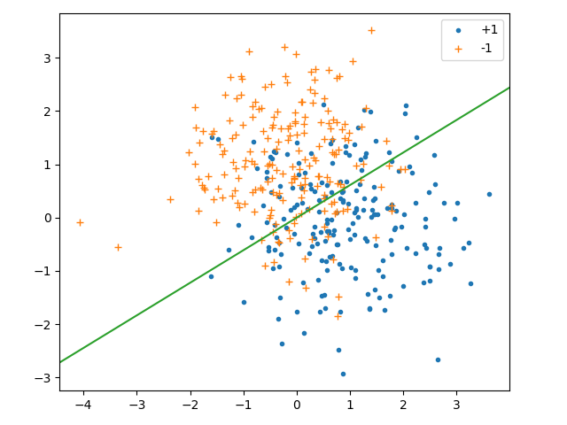
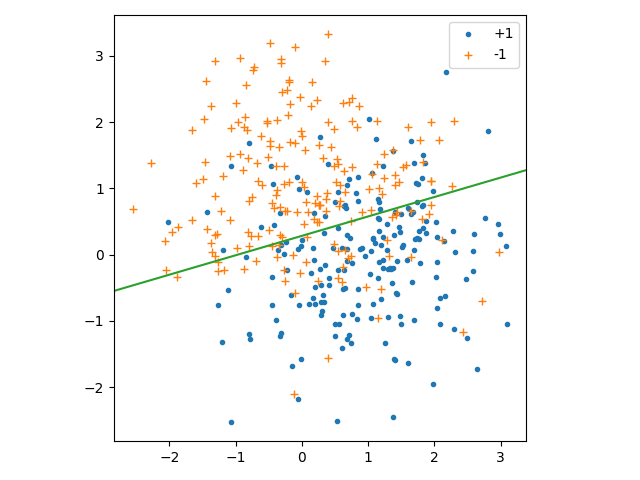
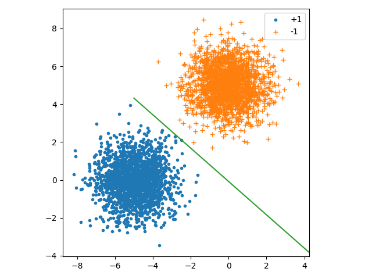
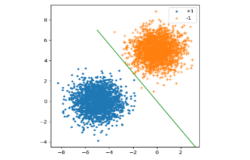

# L2 编程作业
    自实1901班 黄子昊 U201914549
## 1. 算法实现
### PLA算法
```python
import numpy as np
import matplotlib.pyplot as plt
import datetime


class PLA:
    def __init__(self, inputs, labels, train_data_rate=0.8, max_times=10000, seed=0):
        self.train_data_rate = train_data_rate
        self.max_times = max_times
        num_of_inputs = inputs.shape[0]
        np.random.seed(seed)
        np.random.shuffle(inputs)
        np.random.seed(seed)
        np.random.shuffle(labels)
        self.train_x = inputs[0:int(num_of_inputs * self.train_data_rate)]
        self.train_y = labels[0:int(num_of_inputs * self.train_data_rate)]
        self.test_x = inputs[int(num_of_inputs * self.train_data_rate):]
        self.test_y = labels[int(num_of_inputs * self.train_data_rate):]
        self.w = None

    def append1(self, x):
        return np.append(1, x)

    def sign(self, x):
        if x > 0:
            return 1
        elif x < 0:
            return -1
        else:
            return 0

    def train(self):
        times = 0
        PLA_is_over = False
        w = np.zeros(self.train_x.shape[1] + 1)
        n = self.train_x.shape[0]
        inputs = np.zeros((self.train_x.shape[0], self.train_x.shape[1] + 1))
        for i in range(n):
            inputs[i] = self.append1(self.train_x[i])
        while not PLA_is_over and times < self.max_times:
            PLA_is_over = True
            for i in range(n):
                pred_y = np.dot(w, inputs[i])
                signed_pred_y = self.sign(pred_y)
                if signed_pred_y != self.train_y[i]:
                    PLA_is_over = False
                    w += self.train_y[i] * inputs[i]
                    break
            times += 1
        self.w = w
        return w

    def test(self):
        num_right = 0
        n = self.test_x.shape[0]
        for i in range(n):
            if self.sign(np.dot(self.w, self.append1(self.test_x[i]))) == self.test_y[i]:
                num_right += 1
        print("accuracy: " + str(num_right / n))
```

### Pocket算法
```python
import datetime
import numpy as np
import matplotlib.pyplot as plt


class Pocket:
    def __init__(self, inputs, labels, train_data_rate=0.8, max_times=1000, seed=0):
        self.train_data_rate = train_data_rate
        self.max_times = max_times
        num_of_inputs = inputs.shape[0]
        np.random.seed(seed)
        np.random.shuffle(inputs)
        np.random.seed(seed)
        np.random.shuffle(labels)
        self.train_x = inputs[0:int(num_of_inputs * self.train_data_rate)]
        self.train_y = labels[0:int(num_of_inputs * self.train_data_rate)]
        self.test_x = inputs[int(num_of_inputs * self.train_data_rate):]
        self.test_y = labels[int(num_of_inputs * self.train_data_rate):]
        self.w = None
        self.new_train_x = None

    def append1(self, x):
        return np.append(1, x)

    def sign(self, x):
        if x > 0:
            return 1
        elif x < 0:
            return -1
        else:
            return 0

    def num_error(self, w):
        ans = 0
        n = self.new_train_x.shape[0]
        for i in range(n):
            if self.sign(np.dot(w, self.new_train_x[i])) != self.train_y[i]:
                ans += 1
        return ans

    def train(self):
        times = 0
        w = np.zeros(self.train_x.shape[1] + 1)
        best_w = np.zeros(self.train_x.shape[1] + 1)
        n = self.train_x.shape[0]
        min_num_error = n + 1
        self.new_train_x = np.zeros(
            (self.train_x.shape[0], self.train_x.shape[1] + 1))
        for i in range(n):
            self.new_train_x[i] = self.append1(self.train_x[i])

        while times < self.max_times:
            for i in range(n):
                pred_y = np.dot(w, self.new_train_x[i])
                signed_pred_y = self.sign(pred_y)
                if signed_pred_y != labels[i]:
                    w += labels[i] * self.new_train_x[i]
                    this_num_error = self.num_error(w)
                    if this_num_error < min_num_error:
                        min_num_error = this_num_error
                        best_w = np.copy(w)
                    # print("best_w: " + str(best_w) + " w: " + str(w) + " this_num_error: " + str(
                    #     this_num_error) + " times: " + str(times))
                    break
            times += 1
        self.w = best_w

    def test(self):
        num_right = 0
        n = self.test_x.shape[0]
        for i in range(n):
            if self.sign(np.dot(self.w, self.append1(self.test_x[i]))) == self.test_y[i]:
                num_right += 1
        print("accuracy: " + str(num_right / n))
```

## 2. 算法测试
### PLA

```python
if __name__ == "__main__":
    mu1 = np.array([[-5, 0]])
    mu2 = np.array([[0, 5]])
    Sigma = np.array([[1, 0], [0, 1]])
    R = np.linalg.cholesky(Sigma).T
    s1 = np.random.randn(200, 2) @ R + mu1
    s2 = np.random.randn(200, 2) @ R + mu2

    plt.plot(*s1.T, '.', label='+1')
    plt.plot(*s2.T, '+', label='-1')
    plt.axis('scaled')
    plt.legend()

    l1 = np.ones(200)
    l2 = -l1
    inputs = np.concatenate((s1, s2))
    labels = np.concatenate((l1, l2))
    myPLA = PLA(inputs, labels, 0.8)

    start_time = datetime.datetime.now()
    myPLA.train()
    end_time = datetime.datetime.now()
    print("运行时间：" + str((end_time - start_time).microseconds) + " us")
    myPLA.test()

    x = np.linspace(-10, 5, 500)
    y = - myPLA.w[0] / myPLA.w[2] - myPLA.w[1] / myPLA.w[2] * x
    plt.plot(x, y)
    plt.show()
```

### Pocket
```python
if __name__ == "__main__":
    mu1 = np.array([[-5, 0]])
    mu2 = np.array([[0, 5]])
    Sigma = np.array([[1, 0], [0, 1]])
    R = np.linalg.cholesky(Sigma).T
    s1 = np.random.randn(200, 2) @ R + mu1
    s2 = np.random.randn(200, 2) @ R + mu2

    plt.plot(*s1.T, '.', label='+1')
    plt.plot(*s2.T, '+', label='-1')
    plt.axis('scaled')
    plt.legend()

    l1 = np.ones(200)
    l2 = -l1
    inputs = np.concatenate((s1, s2))
    labels = np.concatenate((l1, l2))
    myPLA = Pocket(inputs, labels, 0.8)

    start_time = datetime.datetime.now()
    myPLA.train()
    end_time = datetime.datetime.now()
    print("运行时间：" + str((end_time - start_time).microseconds) + " us")
    myPLA.test()

    x = np.linspace(-10, 5, 500)
    y = - myPLA.w[0] / myPLA.w[2] - myPLA.w[1] / myPLA.w[2] * x
    plt.plot(x, y)
    plt.show()
```
+ 正确率 (c)
  + PLA 100%
  + Pocket 100%
+ 运行时间 (d)
  + PLA 2999 us
  + Pocket 500315 us
+ 数据集和分类面 (e)
  + PLA
    

  + Pocket
    

### 3. 算法测试
+ 正确率 (c)
  + PLA 71.25%
  + Pocket 80.00%
+ 运行时间 (d)
  + PLA 99001 us
  + Pocket 731243 us
+ 数据集和分类面 (e)
  + PLA
    

  + Pocket
    


### 4. 算法修改
#### 当增大样本数量时，由于正态分布的不稳定性，两种算法的准确度都有所下降，下面为数据集大小为4000时的情况。PLA的运行时间增大，Pocket的运行时间基本不变
+ PLA
  
  

+ Pocket

  


当使两样本均值更加靠近时，算法的正确率会有所下降。当两样本均值足够远后，两算法的正确率基本能够达到100%，另外，PLA算法的运行速度会有所减小。
当增大Pocket算法中的最大迭代次数时，算法的运行时间会增加，但是相对应的算法的正确率会有所挺高。
