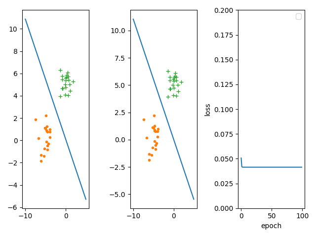
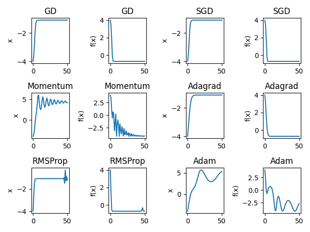

# L3 编程作业
    自实1901班 黄子昊 U201914549
## 1. 算法实现

+ 广义逆矩阵法
```python
import numpy as np

class inverse_method:
    def __init__(self):
        self.w = None

    def train(self, X, Y):
        X_p = np.dot(np.linalg.inv(np.dot(X.transpose(), X)), X.transpose())
        self.w = np.dot(X_p, Y)
        return self.w

    def test(self, X, Y):
        num_right = 0
        n = X.shape[0]
        for i in range(n):
            if np.sign(np.dot(self.w.transpose(), X[i])) == Y[i]:
                num_right += 1
        print("Inverse method accuracy: " + str(num_right / n))

```

+ 梯度下降法
```python
import numpy as np


class GD:
    def __init__(self, shape, lr):
        self.w = np.zeros(shape)
        self.lr = lr
        self.losses = []

    def step(self, X, Y):
        N = X.shape[0]
        self.w -= self.lr * 2 / N * (np.dot(np.dot(X.transpose(), X), self.w) - np.dot(X.transpose(), Y))
        self.losses.append(np.linalg.norm(np.dot(X, self.w) - Y) / N)

    def train(self, X, Y, epochs=100):
        for i in range(epochs):
            self.step(X, Y)

    def test(self, X, Y):
        num_right = 0
        n = X.shape[0]
        for i in range(n):
            if np.sign(np.dot(self.w.transpose(), X[i])) == Y[i]:
                num_right += 1
        print("Gradient descent accuracy: " + str(num_right / n))

```

## 2. 算法测试
```python
import numpy as np
import matplotlib.pyplot as plt
from lib.inverse import *
from lib.gradient_descent import *
from lib.util import *


if __name__ == "__main__":
    mu1 = np.array([[-5, 0]])
    mu2 = np.array([[0, 5]])
    Sigma = np.array([[1, 0], [0, 1]])
    R = np.linalg.cholesky(Sigma).T
    X1 = np.random.randn(200, 2) @ R + mu1
    X2 = np.random.randn(200, 2) @ R + mu2
    Y1 = np.ones((200, 1))
    Y2 = -Y1
    X = np.concatenate((X1, X2))
    X = add_first_1_for_x(X)
    Y = np.concatenate((Y1, Y2))
    train_x, test_x, train_y, test_y = divide_dataset(X, Y, 0.8)
    plt.subplot(131)
    my_inverse_method = inverse_method()
    my_inverse_method.train(train_x, train_y)
    my_inverse_method.test(test_x, test_y)
    x = np.linspace(-10, 5, 500)
    y = - my_inverse_method.w[0] / my_inverse_method.w[2] - my_inverse_method.w[1] / my_inverse_method.w[2] * x
    plt.plot(x, y, label="inverse_method")
    plt.plot(*X1.T, '.', label='+1')
    plt.plot(*X2.T, '+', label='-1')

    plt.subplot(132)
    my_GD = GD((3, 1), 0.04)
    my_GD.train(train_x, train_y, 100)
    my_GD.test(test_x, test_y)
    y = - my_GD.w[0] / my_GD.w[2] - my_GD.w[1] / my_GD.w[2] * x
    plt.plot(x, y, label="Gradient_descent")
    plt.plot(*X1.T, '.', label='+1')
    plt.plot(*X2.T, '+', label='-1')

    plt.subplot(133)
    plt.xlabel("epoch")
    plt.ylabel("loss")
    plt.ylim(0.01, 0.017)
    plt.plot(my_GD.losses)
    plt.legend()

    plt.show()
```

### 解答
+ (b) 分类面
+ (d) 数据集
+ (e) 损失函数随epoch增加的变化曲线
  


+ (c) 分类正确率
  + 广义逆矩阵
    + 训练集 100%
    + 测试集 100%
  + 梯度下降法
    + 训练集 100%
    + 测试集 100%

## 3. 算法测试
### 测试代码
```python
import numpy as np
import matplotlib.pyplot as plt
from lib.inverse import *
from lib.gradient_descent import *
from lib.util import *


if __name__ == "__main__":
    mu1 = np.array([[1, 0]])
    mu2 = np.array([[0, 1]])
    Sigma = np.array([[1, 0], [0, 1]])
    R = np.linalg.cholesky(Sigma).T
    X1 = np.random.randn(200, 2) @ R + mu1
    X2 = np.random.randn(200, 2) @ R + mu2
    Y1 = np.ones((200, 1))
    Y2 = -Y1
    X = np.concatenate((X1, X2))
    X = add_first_1_for_x(X)
    Y = np.concatenate((Y1, Y2))
    train_x, test_x, train_y, test_y = divide_dataset(X, Y, 0.8)
    plt.subplot(131)
    my_inverse_method = inverse_method()
    my_inverse_method.train(train_x, train_y)
    my_inverse_method.test(test_x, test_y)
    x = np.linspace(-10, 5, 500)
    y = - my_inverse_method.w[0] / my_inverse_method.w[2] - my_inverse_method.w[1] / my_inverse_method.w[2] * x
    plt.plot(x, y, label="inverse_method")
    plt.plot(*X1.T, '.', label='+1')
    plt.plot(*X2.T, '+', label='-1')

    plt.subplot(132)
    my_GD = GD((3, 1), 0.04)
    my_GD.train(train_x, train_y, 100)
    my_GD.test(test_x, test_y)
    y = - my_GD.w[0] / my_GD.w[2] - my_GD.w[1] / my_GD.w[2] * x
    plt.plot(x, y, label="Gradient_descent")
    plt.plot(*X1.T, '.', label='+1')
    plt.plot(*X2.T, '+', label='-1')

    plt.subplot(133)
    plt.xlabel("epoch")
    plt.ylabel("loss")
    plt.ylim(0.04, 0.06)
    plt.plot(my_GD.losses)
    plt.legend()

    plt.show()

```

### 解答
+ (b) 分类面
+ (d) 数据集
+ (e) 损失函数随epoch增加的变化曲线
  


+ (c) 分类正确率
  + 广义逆矩阵
    + 训练集 77.1875%
    + 测试集 72.5%
  + 梯度下降法
    + 训练集 77.1875%
    + 测试集 72.5%

## 4. 算法修改
### 样本数量
    将样本数量扩大十倍后


准确率没有太大的变化，或许由于正态分布的不稳定性，有一两个样本点异常导致准确率略有下降。

    将样本数量缩小十倍后


准确率没有太大的变化。

### 样本分布
    样本分布更为集中时


准确率较大程度上减小，这是类间差异性小导致。

### 学习率
    增大学习率


当学习率过大时，梯度下降法的学习能力极差


    减小学习率


在迭代次数足够时，影响不大

### epoch
    减小epoch


由于数据集类间差异较大，epoch=1即可获得较好的分类结果

## 5. 优化算法
### 优化子代码
```python
import numpy as np


class base_optimizer:
    def __init__(self, params, grad_fn):
        self.params = params
        self.grad_fn = grad_fn

    def __str__(self):
        return "base_optimizer"

    def step(self, x):
        self.params = self.params


class GD(base_optimizer):
    def __init__(self, params, grad_fn, lr=0.4):
        super().__init__(params, grad_fn)
        self.lr = lr

    def __str__(self):
        return "GD"

    def step(self):
        self.params = self.params - self.lr * self.grad_fn(self.params)


class SGD(GD):
    def __str__(self):
        return "SGD"


class Momentum(base_optimizer):
    def __init__(self, params, grad_fn, lr=0.4, lam=0.9):
        super().__init__(params, grad_fn)
        self.lr = lr
        self.lam = lam
        self.mt = 0

    def __str__(self):
        return "Momentum"

    def step(self):
        self.mt = self.lam * self.mt - self.lr * self.grad_fn(self.params)
        self.params = self.params + self.mt


class Adagrad(base_optimizer):
    def __init__(self, params, grad_fn, lr=0.4, eps=1e-6):
        super().__init__(params, grad_fn)
        self.lr = lr
        self.eps = eps
        self.grads = []

    def __str__(self):
        return "Adagrad"

    def step(self):
        grad = self.grad_fn(self.params)
        self.grads.append(grad)
        sigma = np.sqrt(self.eps + np.sum(np.array(self.grads) ** 2) / (len(self.grads) + 1))
        self.params = self.params - self.lr * self.grad_fn(self.params) / sigma


class RMSProp(base_optimizer):
    def __init__(self, params, grad_fn, lr=0.4, eps=1e-6, alpha=0.9):
        super().__init__(params, grad_fn)
        self.lr = lr
        self.eps = eps
        self.alpha = 0.9
        self.last_sigma = self.eps

    def __str__(self):
        return "RMSProp"

    def step(self):
        grad = self.grad_fn(self.params)
        sigma = np.sqrt(self.alpha * self.last_sigma ** 2 + (1 - self.alpha) * grad ** 2)
        self.params = self.params - self.lr * grad / sigma
        self.last_sigma = sigma


class Adam(base_optimizer):
    def __init__(self, params, grad_fn, lr=0.4, eps=1e-6, beta1=0.9, beta2=0.999):
        super().__init__(params, grad_fn)
        self.beta1 = beta1
        self.beta2 = beta2
        self.lr = lr
        self.eps = eps
        self.mt = 0
        self.nt = 0
        self.t = 0

    def __str__(self):
        return "Adam"

    def step(self):
        self.t += 1
        grad = self.grad_fn(self.params)
        self.mt = self.beta1 * self.mt + (1 - self.beta1) * grad
        self.nt = self.beta2 * self.nt + (1 - self.beta2) * grad ** 2
        mt_b = self.mt / (1 - self.beta1 ** self.t)
        nt_b = self.nt / (1 - self.beta2 ** self.t)
        self.params = self.params - mt_b / (nt_b ** 0.5 + self.eps)
```
### 测试代码
```python
from lib.optimizer import *
import matplotlib.pyplot as plt
import math

if __name__ == "__main__":
    fn = lambda x: x * math.cos(0.25 * math.pi * x)
    grad_fn = lambda x: math.cos(0.25 * math.pi * x) - 0.25 * math.pi * x * math.sin(0.25 * math.pi * x)
    x0 = -4
    epochs = 100
    lr = 0.4

    optimizers = [GD, SGD, Momentum, Adagrad, RMSProp, Adam]
    optimizer_list = [Op(x0, grad_fn, lr=lr) for Op in optimizers]
    sub_num = 0
    plt.xlabel("epoch")
    for optimizer in optimizer_list:
        x = [x0]
        fx = [fn(x0)]
        for epoch in range(epochs):
            optimizer.step()
            x.append(optimizer.params)
            fx.append(fn(optimizer.params))
        sub_num += 1
        plt.subplot(3, 4, sub_num)
        plt.ylabel("x")
        plt.title(optimizer.__str__())
        plt.plot(x)
        sub_num += 1
        plt.subplot(3, 4, sub_num)
        plt.ylabel("f(x)")
        plt.title(optimizer.__str__())
        plt.plot(fx)

    plt.show()
    for optimizer in optimizer_list:
        print("class name: {}, x: {}, f(x): {}".format(optimizer.__class__, optimizer.params, fn(optimizer.params)))
```
+ 输出结果
  
        class name: <class 'lib.optimizer.GD'>, x: -1.0957845598538827, f(x): -0.7144099321984125
        class name: <class 'lib.optimizer.SGD'>, x: -1.0957845598538827, f(x): -0.7144099321984125
        class name: <class 'lib.optimizer.Momentum'>, x: 2.943042488108246, f(x): -1.985900284700558
        class name: <class 'lib.optimizer.Adagrad'>, x: -1.1084631116897157, f(x): -0.7142707804225432
        class name: <class 'lib.optimizer.RMSProp'>, x: -1.0954107473553287, f(x): -0.7144100461909331
        class name: <class 'lib.optimizer.Adam'>, x: 0.07825619990244456, f(x): 0.07810843567379486


+ 图像
  
  

+ 若迭代50次，并将Adam的beta1改为0.99
  
        class name: <class 'lib.optimizer.GD'>, x: -1.0954107472034038, f(x): -0.7144100461909332
        class name: <class 'lib.optimizer.SGD'>, x: -1.0954107472034038, f(x): -0.7144100461909332
        class name: <class 'lib.optimizer.Momentum'>, x: 4.163605638526643, f(x): -4.129280029606941
        class name: <class 'lib.optimizer.Adagrad'>, x: -1.0954107472034036, f(x): -0.7144100461909332
        class name: <class 'lib.optimizer.RMSProp'>, x: -1.227603445544681, f(x): -0.6998680886340165
        class name: <class 'lib.optimizer.Adam'>, x: 5.3332602396639235, f(x): -2.666895266305945
  
  

+ 经不断调整尝试，认为不同优化子横向比较而言，adam的性能更好，根据不同的模型，需要适当改变lr，而alpha,beta等参数一般不需要改变
+ Momentum方法更容易摆脱local max
+ Adam的beta1增大后更接近Momentum方法