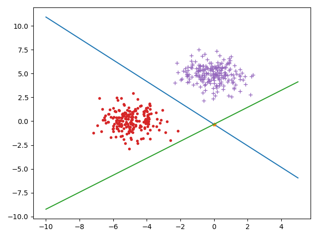

# L4 编程作业
    自实1901班 黄子昊 U201914549
## 1. 算法实现
```python
import numpy as np


class Fisher:
    def __init__(self):
        self.lenX = 0
        self.w = None
        self.y0 = None

    def train(self, XY1, XY2):
        X1 = XY1[0]
        Y1 = XY1[1]
        X2 = XY2[0]
        Y2 = XY2[1]
        self.lenX = X1.shape[1]
        u1 = np.average(X1, axis=0)
        u2 = np.average(X2, axis=0)
        s1 = np.zeros((self.lenX, self.lenX))
        s2 = np.zeros((self.lenX, self.lenX))
        for i in range(X1.shape[0]):
            s1 = np.add(((X1[i] - u1).reshape(self.lenX, 1) @
                        (X1[i] - u1).reshape(1, self.lenX)), s1)
        for i in range(X2.shape[0]):
            s2 = np.add(((X2[i] - u2).reshape(self.lenX, 1) @
                        (X2[i] - u2).reshape(1, self.lenX)), s2)
        sw = s1 + s2
        self.w = np.linalg.inv(sw) @ (u1 - u2).reshape(self.lenX, 1)
        self.y0 = self.w.T @ (u1 + u2).reshape(self.lenX, 1) / 2

        num_right = 0
        n1 = X1.shape[0]
        for i in range(n1):
            if np.sign(np.dot(self.w.T, X1[i]) - self.y0) == Y1[i]:
                num_right += 1
        n2 = X2.shape[0]
        for i in range(n2):
            if np.sign(np.dot(self.w.T, X2[i]) - self.y0) == Y2[i]:
                num_right += 1
        print("Train accuracy: " + str(num_right / (n1 + n2)))

    def test(self, X, Y):
        num_right = 0
        n = X.shape[0]
        for i in range(n):
            if np.sign(np.dot(self.w.T, X[i]) - self.y0) == Y[i]:
                num_right += 1
        print("Test accuracy: " + str(num_right / n))
```
## 2. 算法测试

### 测试代码

```python
import matplotlib.pyplot as plt
from src.Fisher import *
from src.util import *

if __name__ == "__main__":
    mu1 = np.array([[-5, 0]])
    mu2 = np.array([[0, 5]])
    Sigma = np.array([[1, 0], [0, 1]])
    R = np.linalg.cholesky(Sigma).T
    X1 = np.random.randn(200, 2) @ R + mu1
    X2 = np.random.randn(200, 2) @ R + mu2
    Y1 = np.ones((200, 1))
    Y2 = -Y1
    train_x1, test_x1, train_y1, test_y1 = divide_dataset(X1, Y1, 0.8, 1)
    train_x2, test_x2, train_y2, test_y2 = divide_dataset(X2, Y2, 0.8, 1)
    test_x = np.concatenate((test_x1, test_x2))
    test_y = np.concatenate((test_y1, test_y2))
    my_fisher = Fisher()
    my_fisher.train((train_x1, train_y1), (train_x2, train_y2))
    my_fisher.test(test_x, test_y)

    X = np.concatenate((X1, X2))
    Y = np.concatenate((Y1, Y2))

    x = np.linspace(-10, 5, 500)
    y = my_fisher.y0 / my_fisher.w[1] - my_fisher.w[0] / my_fisher.w[1] * x
    plt.plot(x, y[0], label="Fisher")
    plt.plot(*X1.T, '.', label='+1')
    plt.plot(*X2.T, '+', label='-1')

    plt.show()
```

### 解答
+ (b) 投影向量、分类阈值
  
    

+ (c) 分类正确率
  
    + 训练集 100%
    + 测试集 100%
  
+ (d) 分类图像

    

    其中 橙色点 为分类阈值点, 绿色线 为最佳投影方向