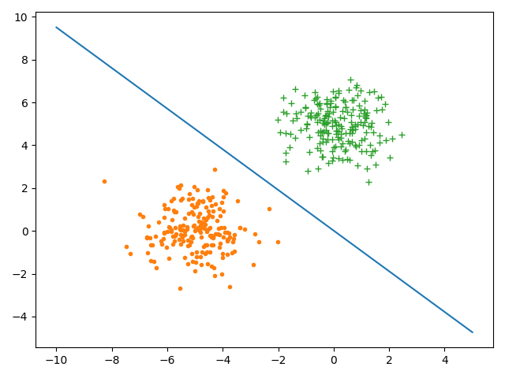
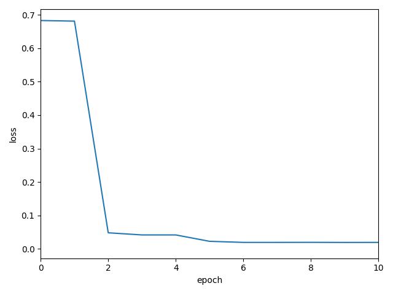
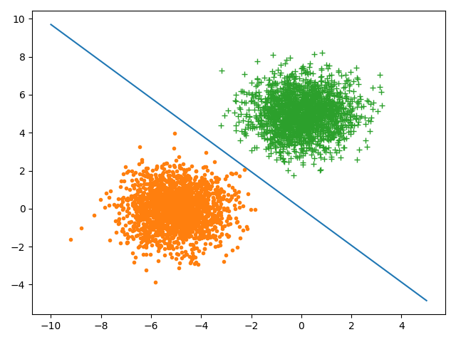
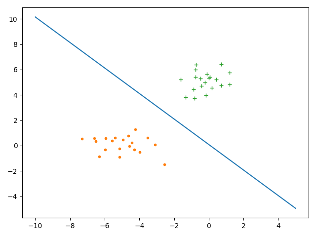
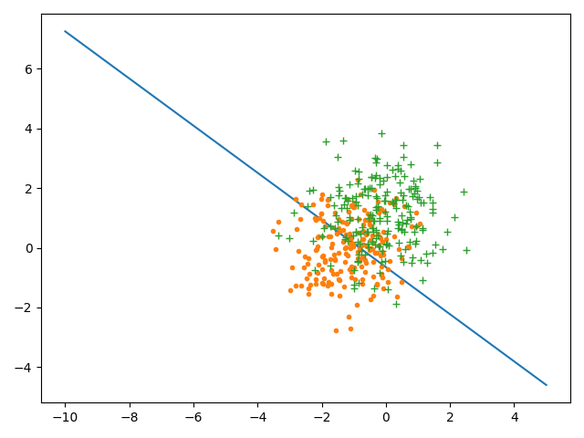
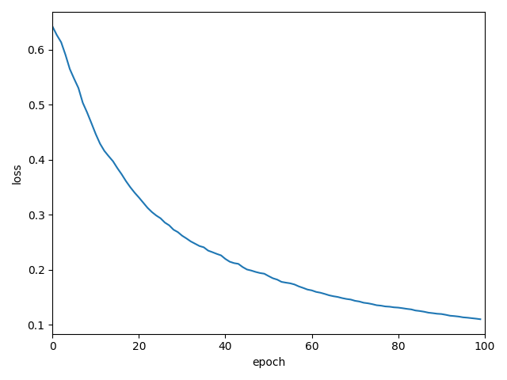
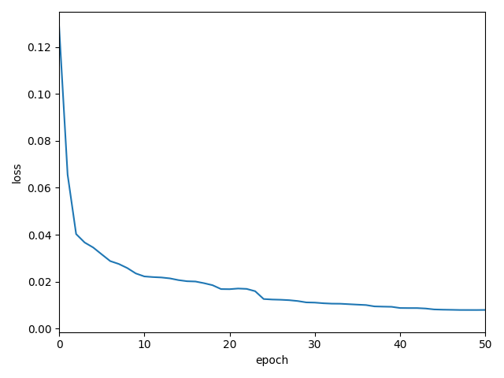

# L5 编程作业
    自实1901班 黄子昊 U201914549
## 1. 算法实现

```python
from lib.optimizer import *


class Logistic:
    def __init__(self, X, Y, lr=0.4, batch_size=1):
        self.lr = lr
        self.X = X
        self.Y = Y
        self.w = np.zeros((self.X.shape[-1], self.Y.shape[-1]))
        self.SGD = SGD(self.w, self.grad_fn, self.X, self.Y, lr, batch_size)
        self.losses = []
        self.N = self.X.shape[0]

    def step(self):
        self.w = self.SGD.step()
        self.losses.append(self.CrossEntropyLoss(self.w, self.X, self.Y))

    def train(self, epochs=100):
        for i in range(epochs):
            self.step()

    def test(self, X, Y):
        for i in range(X.shape[0]):
            probability = self.Sigmoid(self.w.T @ X[i])
            if Y[i] == -1:
                probability = 1 - probability

            print("Sample ID: {}, Class: {}, Probability: {}".format(i, Y[i][0], probability))

    @staticmethod
    def grad_fn(w, x, y):
        y = y.reshape(-1, 1)
        x = x.reshape(-1, 1)
        return Logistic.Sigmoid(-y @ w.T @ x) * -y * x

    @staticmethod
    def CrossEntropyLoss(w, X, Y):
        loss = 0
        n = X.shape[0]
        for i in range(n):
            loss += np.log(1 + np.exp(-Y[i] * w.T @ X[i].T.reshape(X.shape[-1], 1)))
        loss /= n
        return loss[0]

    @staticmethod
    def Sigmoid(X):
        return np.exp(X) / (1 + np.exp(X))
```

```python
class base_optimizer:
    def __init__(self, params, grad_fn):
        self.params = params
        self.grad_fn = grad_fn

    def __str__(self):
        return "base_optimizer"

    def step(self, x):
        self.params = self.params


class GD(base_optimizer):
    def __init__(self, params, grad_fn, lr=0.4):
        super().__init__(params, grad_fn)
        self.lr = lr

    def __str__(self):
        return "GD"

    def step(self):
        self.params = self.params - self.lr * self.grad_fn(self.params)


class SGD(GD):
    def __init__(self, params, grad_fn, X, Y, lr=0.4, batch_size=1):
        super().__init__(params, grad_fn)
        self.X = X
        self.Y = Y
        self.lr = lr
        self.batch_size = batch_size
        self.lenX = X.shape[0]

    def step(self):
        grad = 0
        for i in range(self.batch_size):
            j = random.randint(0, self.lenX-self.batch_size)
            grad += self.grad_fn(self.params, self.X[j], self.Y[j])
        self.params = self.params - self.lr * grad / self.batch_size
        return self.params

    def __str__(self):
        return "SGD"
```

## 2. 算法测试

### 测试代码

```python
import matplotlib.pyplot as plt
from lib.Logistic import *
from lib.util import *

if __name__ == "__main__":
    lr = 0.4
    batch_size = 2
    mu1 = np.array([[-5, 0]])
    mu2 = np.array([[0, 5]])
    Sigma = np.array([[1, 0], [0, 1]])
    R = np.linalg.cholesky(Sigma).T
    X1 = np.random.randn(200, 2) @ R + mu1
    X2 = np.random.randn(200, 2) @ R + mu2
    Y1 = np.ones((200, 1))
    Y2 = -Y1
    X = np.concatenate((X1, X2))
    X = add_first_1_for_x(X)
    Y = np.concatenate((Y1, Y2))
    train_x, test_x, train_y, test_y = divide_dataset(X, Y, 0.8)
    my_logistic = Logistic(train_x, train_y, lr, batch_size)
    my_logistic.train()
    my_logistic.test(test_x, test_y)

    x = np.linspace(-10, 5, 500)
    y = - my_logistic.w[0] / my_logistic.w[2] - my_logistic.w[1] / my_logistic.w[2] * x
    # plt.plot(x, y, label="Logistic")
    # plt.plot(*X1.T, '.', label='+1')
    # plt.plot(*X2.T, '+', label='-1')
    plt.xlabel("epoch")
    plt.ylabel("loss")
    plt.xlim(0, 10)
    plt.plot(my_logistic.losses)
    plt.show()

```

### 解答

+ (c) 每个测试样本的分类值

    ```
    Sample ID: 0, Class: 1.0, Probability: [0.99972065]
    Sample ID: 1, Class: -1.0, Probability: [0.99907021]
    Sample ID: 2, Class: -1.0, Probability: [0.99942711]
    Sample ID: 3, Class: -1.0, Probability: [0.99975756]
    Sample ID: 4, Class: -1.0, Probability: [0.99976212]
    Sample ID: 5, Class: -1.0, Probability: [0.99401468]
    Sample ID: 6, Class: 1.0, Probability: [0.99912511]
    Sample ID: 7, Class: 1.0, Probability: [0.99964456]
    Sample ID: 8, Class: -1.0, Probability: [0.99581371]
    Sample ID: 9, Class: -1.0, Probability: [0.99989408]
    Sample ID: 10, Class: 1.0, Probability: [0.99622565]
    Sample ID: 11, Class: 1.0, Probability: [0.99756473]
    Sample ID: 12, Class: -1.0, Probability: [0.99999203]
    Sample ID: 13, Class: 1.0, Probability: [0.99990997]
    Sample ID: 14, Class: -1.0, Probability: [0.99475723]
    Sample ID: 15, Class: 1.0, Probability: [0.99969845]
    Sample ID: 16, Class: -1.0, Probability: [0.98782264]
    Sample ID: 17, Class: -1.0, Probability: [0.99968267]
    Sample ID: 18, Class: -1.0, Probability: [0.99997808]
    Sample ID: 19, Class: 1.0, Probability: [0.98427361]
    Sample ID: 20, Class: 1.0, Probability: [0.99993602]
    Sample ID: 21, Class: -1.0, Probability: [0.9999125]
    Sample ID: 22, Class: -1.0, Probability: [0.99484442]
    Sample ID: 23, Class: -1.0, Probability: [0.99806612]
    Sample ID: 24, Class: 1.0, Probability: [0.99857251]
    Sample ID: 25, Class: 1.0, Probability: [0.99214612]
    Sample ID: 26, Class: -1.0, Probability: [0.99985764]
    Sample ID: 27, Class: 1.0, Probability: [0.99742172]
    Sample ID: 28, Class: -1.0, Probability: [0.99035984]
    Sample ID: 29, Class: 1.0, Probability: [0.99974773]
    Sample ID: 30, Class: 1.0, Probability: [0.99999304]
    Sample ID: 31, Class: 1.0, Probability: [0.98836813]
    Sample ID: 32, Class: 1.0, Probability: [0.99998149]
    Sample ID: 33, Class: -1.0, Probability: [0.99728096]
    Sample ID: 34, Class: -1.0, Probability: [0.99923159]
    Sample ID: 35, Class: 1.0, Probability: [0.99958518]
    Sample ID: 36, Class: 1.0, Probability: [0.99923956]
    Sample ID: 37, Class: 1.0, Probability: [0.98079714]
    Sample ID: 38, Class: 1.0, Probability: [0.97173915]
    Sample ID: 39, Class: -1.0, Probability: [0.99989903]
    Sample ID: 40, Class: -1.0, Probability: [0.99999914]
    Sample ID: 41, Class: -1.0, Probability: [0.99993759]
    Sample ID: 42, Class: 1.0, Probability: [0.999461]
    Sample ID: 43, Class: -1.0, Probability: [0.99883467]
    Sample ID: 44, Class: -1.0, Probability: [0.99037638]
    Sample ID: 45, Class: 1.0, Probability: [0.99412736]
    Sample ID: 46, Class: 1.0, Probability: [0.99979619]
    Sample ID: 47, Class: -1.0, Probability: [0.99127139]
    Sample ID: 48, Class: -1.0, Probability: [0.99980078]
    Sample ID: 49, Class: 1.0, Probability: [0.9987433]
    Sample ID: 50, Class: -1.0, Probability: [0.99980564]
    Sample ID: 51, Class: 1.0, Probability: [0.99218886]
    Sample ID: 52, Class: -1.0, Probability: [0.9999749]
    Sample ID: 53, Class: 1.0, Probability: [0.99991131]
    Sample ID: 54, Class: -1.0, Probability: [0.99936271]
    Sample ID: 55, Class: 1.0, Probability: [0.9999394]
    Sample ID: 56, Class: 1.0, Probability: [0.99459906]
    Sample ID: 57, Class: -1.0, Probability: [0.99965262]
    Sample ID: 58, Class: -1.0, Probability: [0.99942621]
    Sample ID: 59, Class: 1.0, Probability: [0.9771666]
    Sample ID: 60, Class: -1.0, Probability: [0.999767]
    Sample ID: 61, Class: 1.0, Probability: [0.99846]
    Sample ID: 62, Class: 1.0, Probability: [0.99965423]
    Sample ID: 63, Class: -1.0, Probability: [0.99825054]
    Sample ID: 64, Class: 1.0, Probability: [0.99963713]
    Sample ID: 65, Class: 1.0, Probability: [0.99995282]
    Sample ID: 66, Class: 1.0, Probability: [0.99937715]
    Sample ID: 67, Class: -1.0, Probability: [0.99991078]
    Sample ID: 68, Class: -1.0, Probability: [0.99998928]
    Sample ID: 69, Class: -1.0, Probability: [0.9999328]
    Sample ID: 70, Class: -1.0, Probability: [0.99993978]
    Sample ID: 71, Class: 1.0, Probability: [0.9993049]
    Sample ID: 72, Class: -1.0, Probability: [0.99976689]
    Sample ID: 73, Class: 1.0, Probability: [0.99922369]
    Sample ID: 74, Class: -1.0, Probability: [0.99927701]
    Sample ID: 75, Class: -1.0, Probability: [0.99733893]
    Sample ID: 76, Class: 1.0, Probability: [0.99551918]
    Sample ID: 77, Class: 1.0, Probability: [0.99994321]
    Sample ID: 78, Class: 1.0, Probability: [0.9994514]
    Sample ID: 79, Class: 1.0, Probability: [0.99978567]
    ```

+ (d) 数据集和分类面

    

+ (e) 损失函数曲线

    

+ (f) 改变超参数
  + 样本数量
    
    当样本增大十倍时，分类的准确度大致不变

    

    当样本减小十倍时，分类的准确度大致不变

    

  + 样本分布
    
    当样本分布更紧密时，由于类间差异减小，模型的分类效果明显下降

    

  + 学习率
  
    默认学习率为0.4，当将学习率减小10倍时，模型学习的速率减小

    
  
  + batch_size
  
    当batch_size增大为4时，loss的下降速率明显减小

    
  
  + epoch
  
    增大epoch后，模型的loss相对更小，但是随epoch的不断增大，模型loss的下降速率也不断减小，模型趋于收敛。