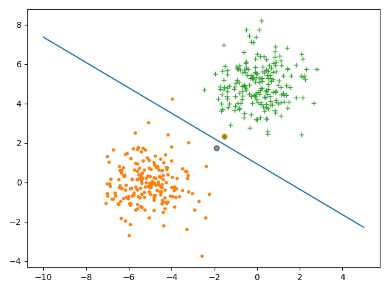
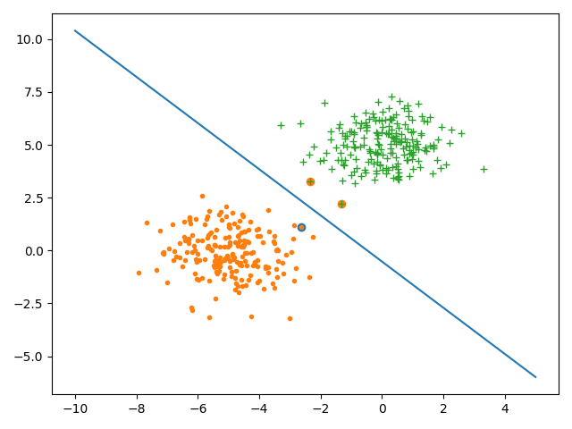
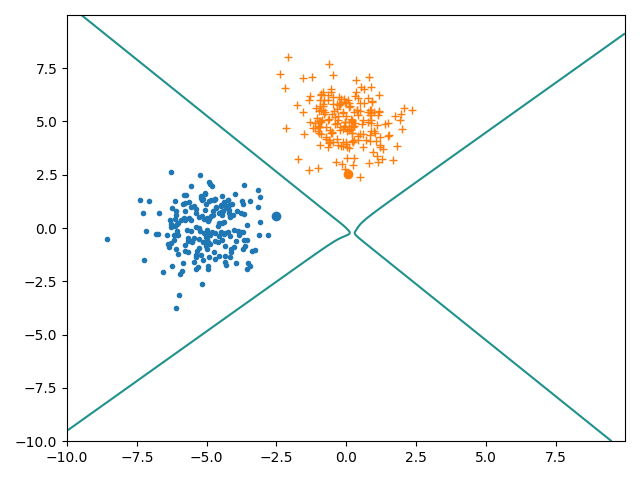
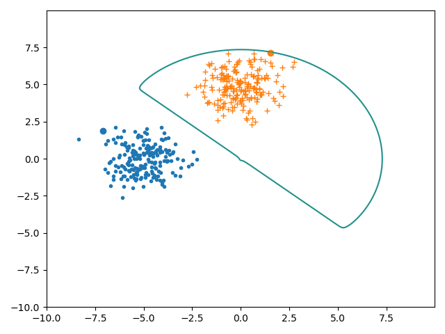
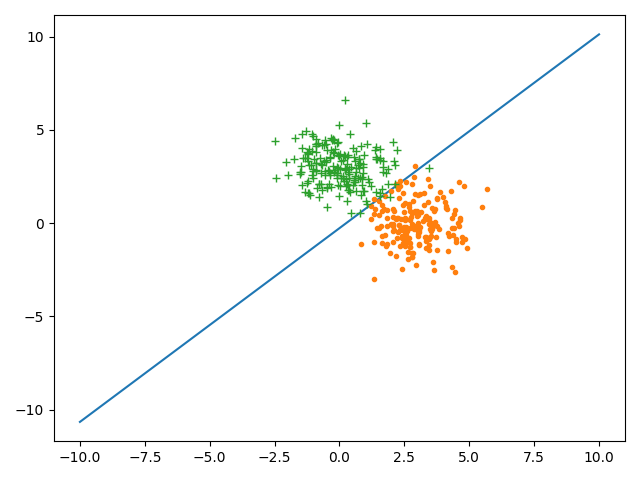
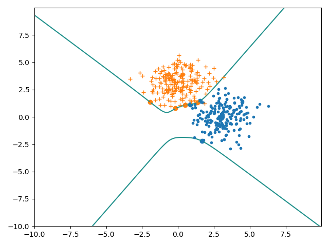
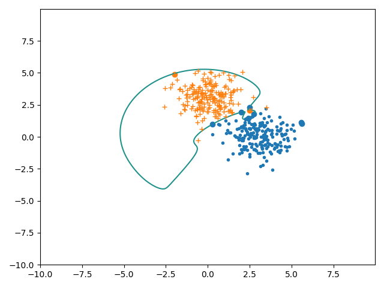
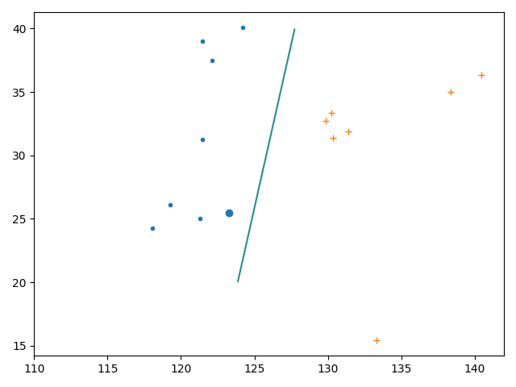
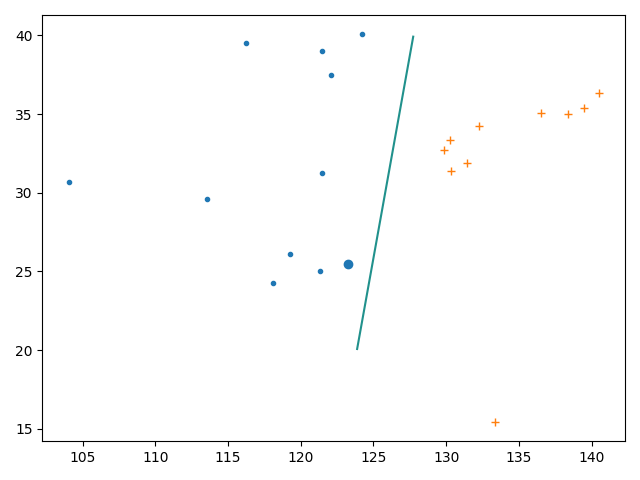

# L7、8 编程作业
    自实1901班 黄子昊 U201914549
## 1. 算法实现

### PrimalSVM算法

```python
import numpy as np
import cvxopt
from lib.util import *


class PrimalSVM:
    def __init__(self, X, Y):
        self.d = X.shape[1]
        self.A = np.ones_like(X)
        self.w = None
        self.Q = np.eye(self.d)
        self.Q[0][0] = 0
        self.p = np.zeros((self.d, 1))
        for i in range(self.A.shape[0]):
            self.A[i] = Y[i] * X[i]
        self.c = np.ones((self.A.shape[0], 1))

        self.Q = cvxopt.matrix(self.Q, tc='d')
        self.p = cvxopt.matrix(self.p, tc='d')
        self.A = cvxopt.matrix(self.A, tc='d')
        self.c = cvxopt.matrix(self.c, tc='d')

    def QP(self):
        ret = cvxopt.solvers.qp(self.Q, self.p, -self.A, -self.c)
        self.w = ret['x']
        return ret['x']

    def test(self, X, Y):
        num_right = 0
        n = X.shape[0]
        for i in range(n):
            if np.sign(np.dot(self.w.T, X[i])) == Y[i]:
                num_right += 1
        print("Test accuracy: " + str(num_right / n))

```

### KernelSVM算法

```python
import numpy as np
import cvxopt
from lib.util import *


class KernelSVM:
    def __init__(self, X, Y, kernel_function):
        self.d = X.shape[1]
        self.kernel_function = kernel_function
        self.X = X
        self.Y = Y
        self.A = np.ones_like(X)
        self.w = np.zeros(self.d)
        self.Q = np.ones((X.shape[0], X.shape[0]))
        for i in range(X.shape[0]):
            for j in range(X.shape[0]):
                self.Q[i][j] = Y[i] * Y[j] * kernel_function(X[i][1:], X[j][1:])
        self.p = -np.ones((self.A.shape[0], 1))
        self.u = None
        self.c = np.zeros((self.A.shape[0], 1))
        self.v = 0
        self.A = np.eye(X.shape[0])
        self.r = Y.T
        self.alpha = None

        self.Q = cvxopt.matrix(self.Q, tc='d')
        self.p = cvxopt.matrix(self.p, tc='d')
        self.A = cvxopt.matrix(self.A, tc='d')
        self.c = cvxopt.matrix(self.c, tc='d')
        self.r = cvxopt.matrix(self.r, tc='d')
        self.v = cvxopt.matrix(self.v, tc='d')

    def QP(self):
        ret = cvxopt.solvers.qp(self.Q, self.p, -self.A, -self.c, self.r, self.v)
        self.alpha = ret['x']
        max_alpha = -1
        j = -1
        for i in range(self.X.shape[0]):
            self.w[1:] += self.alpha[i] * self.Y[i] * self.X[i][1:]
            if self.alpha[i] > max_alpha:
                max_alpha = self.alpha[i]
                j = i
        temp_sum = 0
        for i in range(self.X.shape[0]):
            temp_sum += self.alpha[i] * self.Y[i] * self.kernel_function(self.X[j][1:], self.X[i][1:])
        self.w[0] = self.Y[j] - temp_sum
        return self.w

    def test(self, X, Y):
        num_right = 0
        n = X.shape[0]
        for i in range(n):
            if np.sign(np.dot(self.w.T, X[i])) == Y[i]:
                num_right += 1
        print("Test accuracy: " + str(num_right / n))
```

### DualSVM算法

```python
from lib.KernelSVM import *


class DualSVM(KernelSVM):
    def __init__(self, X, Y):
        super().__init__(X, Y, self.kernel_function)

    @staticmethod
    def kernel_function(x1, x2):
        return x1.T @ x2
```

## 2. 算法测试

### 测试代码

```python
import matplotlib.pyplot as plt
from lib.PrimalSVM import *
from lib.util import *

if __name__ == "__main__":
    size = 200
    mu1 = np.array([[-5, 0]])
    mu2 = np.array([[0, 5]])
    Sigma = np.array([[1, 0], [0, 1]])
    R = np.linalg.cholesky(Sigma).T
    X1 = np.random.randn(size, 2) @ R + mu1
    X2 = np.random.randn(size, 2) @ R + mu2
    Y1 = np.ones((size, 1))
    Y2 = -Y1
    X = np.concatenate((X1, X2))
    X = add_first_1_for_x(X)
    Y = np.concatenate((Y1, Y2))
    train_x, test_x, train_y, test_y = divide_dataset(X, Y, 0.8)
    my_PrimalSVM = PrimalSVM(train_x, train_y)
    my_PrimalSVM.QP()
    my_PrimalSVM.test(train_x, train_y)
    my_PrimalSVM.test(test_x, test_y)

    x = np.linspace(-10, 5, 500)
    y = - my_PrimalSVM.w[0] / my_PrimalSVM.w[2] - my_PrimalSVM.w[1] / my_PrimalSVM.w[2] * x
    plt.plot(x, y, label="PrimalSVM")
    plt.plot(*X1.T, '.', label='+1')
    plt.plot(*X2.T, '+', label='-1')

    X1_tx = []
    X1_ty = []
    X2_tx = []
    X2_ty = []
    for this_x in X1:
        if abs(my_PrimalSVM.w[1:].T @ this_x + my_PrimalSVM.w[0] - 1) < 1e-3:
            X1_tx.append(this_x[0])
            X1_ty.append(this_x[1])
    for this_x in X2:
        if abs(my_PrimalSVM.w[1:].T @ this_x + my_PrimalSVM.w[0] + 1) < 1e-3:
            X2_tx.append(this_x[0])
            X2_ty.append(this_x[1])
    if len(X1_tx):
        plt.scatter(X1_tx, X1_ty)
    if len(X2_tx):
        plt.scatter(X2_tx, X2_ty)
    plt.show()
```

### 解答

+ (c) 每个测试样本的分类值

    + KernelSVM 四次多项式
      + 训练集 100%
      + 测试集 100%
      
    + KernelSVM 高斯核函数
      + 训练集 100%
      + 测试集 100%

    + DualSVM
      + 训练集 100%
      + 测试集 100%
      
    + PrimalSVM
      + 训练集 100%
      + 测试集 100%

+ (d、e) 支撑向量、数据集和分类面
    + PrimalSVM
        

    + DualSVM
        
    
    + KernelSVM 四次多项式
        

    + KernelSVM 高斯核函数
        
        
    存在边界上的向量不是支撑向量的情况

## 3. 算法测试
    修改数据集的均值向量

+ (c) 每个测试样本的分类值

    + KernelSVM 四次多项式
      + 训练集 100%
      + 测试集 98.75%
      
    + KernelSVM 高斯核函数
      + 训练集 100%
      + 测试集 95%
      
    + DualSVM
      + 训练集 98.125%
      + 测试集 100%

    + PrimalSVM
      + 训练集 98.125%
      + 测试集 100%

+ (d、e) 支撑向量、数据集和分类面
    + PrimalSVM
        

    + DualSVM
        
    
    + KernelSVM 四次多项式
        

    + KernelSVM 高斯核函数
        

## 样本修改

  + 样本数量
    
    当样本增大十倍时，分类的准确度大致不变


    当样本减小十倍时，分类的准确度大致不变


  + 样本分布
    
    当样本分布更紧密时，由于类间差异减小，模型的分类效果明显下降


## 5. 算法创新

### 数据集

+ 训练集
```
   X1 = np.array([[119.28, 26.08],
                   [121.31, 25.03],
                   [121.47, 31.23],
                   [118.06, 24.27],
                   [121.46, 39.04],
                   [122.10, 37.50],
                   [124.23, 40.07]])

    X2 = np.array([[129.87, 32.75],
                   [130.33, 31.36],
                   [131.42, 31.91],
                   [130.24, 33.35],
                   [133.33, 15.43],
                   [138.38, 34.98],
                   [140.47, 36.37]])
```
+ 测试集

```
test_x, test_y = np.array([123.28, 25.45]), np.array([1])
```

### (1) 测试代码

```python
import matplotlib.pyplot as plt
from numpy.core.numeric import ones_like
from lib.KernelSVM import *
from lib.util import *


def guass_kernel_function(x_i):
    if len(x_i.shape) == 1:
        return np.exp(-(x_i[0] ** 2 + x_i[1] ** 2)) * np.array(
            [1, x_i[0], x_i[1], x_i[0] * x_i[0], x_i[0] * x_i[1], x_i[1] * x_i[1],
             x_i[0] * x_i[0] * x_i[0], x_i[0] * x_i[0] * x_i[1], x_i[0] * x_i[1] * x_i[1],
             x_i[1] * x_i[1] * x_i[1]])

    elif len(x_i.shape) == 3:
        shape1, shape2 = x_i.shape[1:]
        ret = np.zeros((10, shape1, shape2))
        for i in range(shape1):
            for j in range(shape2):
                ret[:, i, j] = np.exp(-(x_i[0][i][j] ** 2 + x_i[1][i][j] ** 2)) * np.array(
                    [1, x_i[0][i][j], x_i[1][i][j], x_i[0][i][j] * x_i[0][i][j], x_i[0][i][j] * x_i[1][i][j],
                     x_i[1][i][j] * x_i[1][i][j],
                     x_i[0][i][j] * x_i[0][i][j] * x_i[0][i][j], x_i[0][i][j] * x_i[0][i][j] * x_i[1][i][j],
                     x_i[0][i][j] * x_i[1][i][j] * x_i[1][i][j], x_i[1][i][j] * x_i[1][i][j] * x_i[1][i][j]])
        return ret


def line2_kernel_function(x_i):
    if len(x_i.shape) == 1:
        return np.array([x_i[0], x_i[1]])
    elif len(x_i.shape) == 3:
        shape1, shape2 = x_i.shape[1:]
        ret = np.zeros((2, shape1, shape2))
        for i in range(shape1):
            for j in range(shape2):
                ret[:, i, j] = np.array([x_i[0][i][j], x_i[1][i][j]])
        return ret


def line4_kernel_function(x_i):
    if len(x_i.shape) == 1:
        return np.array([1, x_i[0], x_i[1], x_i[0] * x_i[0], x_i[0] * x_i[1], x_i[1] * x_i[1],
                         x_i[0] * x_i[0] * x_i[0], x_i[0] * x_i[0] * x_i[1], x_i[0] * x_i[1] * x_i[1],
                         x_i[1] * x_i[1] * x_i[1],
                         x_i[0] * x_i[0] * x_i[0] * x_i[0], x_i[0] * x_i[0] * x_i[0] * x_i[1],
                         x_i[0] * x_i[0] * x_i[1] * x_i[1],
                         x_i[0] * x_i[1] * x_i[1] * x_i[1], x_i[1] * x_i[1] * x_i[1] * x_i[1]])

    elif len(x_i.shape) == 3:
        shape1, shape2 = x_i.shape[1:]
        ret = np.zeros((15, shape1, shape2))
        for i in range(shape1):
            for j in range(shape2):
                ret[:, i, j] = np.array(
                    [1, x_i[0][i][j], x_i[1][i][j], x_i[0][i][j] * x_i[0][i][j], x_i[0][i][j] * x_i[1][i][j],
                     x_i[1][i][j] * x_i[1][i][j],
                     x_i[0][i][j] * x_i[0][i][j] * x_i[0][i][j], x_i[0][i][j] * x_i[0][i][j] * x_i[1][i][j],
                     x_i[0][i][j] * x_i[1][i][j] * x_i[1][i][j], x_i[1][i][j] * x_i[1][i][j] * x_i[1][i][j],
                     x_i[0][i][j] * x_i[0][i][j] * x_i[0][i][j] * x_i[0][i][j],
                     x_i[0][i][j] * x_i[0][i][j] * x_i[0][i][j] * x_i[1][i][j],
                     x_i[0][i][j] * x_i[0][i][j] * x_i[1][i][j] * x_i[1][i][j],
                     x_i[0][i][j] * x_i[1][i][j] * x_i[1][i][j] * x_i[1][i][j],
                     x_i[1][i][j] * x_i[1][i][j] * x_i[1][i][j] * x_i[1][i][j]])
        return ret


kernel_function = line2_kernel_function
if __name__ == "__main__":
    X1 = np.array([[119.28, 26.08],
                   [121.31, 25.03],
                   [121.47, 31.23],
                   [118.06, 24.27],
                   [121.46, 39.04],
                   [122.10, 37.50],
                   [124.23, 40.07]])

    X2 = np.array([[129.87, 32.75],
                   [130.33, 31.36],
                   [131.42, 31.91],
                   [130.24, 33.35],
                   [133.33, 15.43],
                   [138.38, 34.98],
                   [140.47, 36.37]])

    # X1 = np.array([[119.28, 26.08],
    #                [121.31, 25.03],
    #                [121.47, 31.23],
    #                [118.06, 24.27],
    #                [113.53, 29.58],
    #                [104.06, 30.67],
    #                [116.25, 39.54],
    #                [121.46, 39.04],
    #                [122.10, 37.50],
    #                [124.23, 40.07]])
    #
    # X2 = np.array([[129.87, 32.75],
    #                [130.33, 31.36],
    #                [131.42, 31.91],
    #                [130.24, 33.35],
    #                [136.54, 35.10],
    #                [132.27, 34.24],
    #                [139.46, 35.42],
    #                [133.33, 15.43],
    #                [138.38, 34.98],
    #                [140.47, 36.37]])

    Y1 = np.ones((X1.shape[0], 1))
    Y2 = -np.ones((X2.shape[0], 1))
    X = np.concatenate((X1, X2))
    X = add_first_1_for_x(X)
    Y = np.concatenate((Y1, Y2))
    # train_x, test_x, train_y, test_y = divide_dataset(X, Y, 0.8)
    train_x, train_y = X, Y
    test_x, test_y = np.array([[1, 123.28, 25.45]]), np.array([[1]])
    my_KernelSVM = KernelSVM(train_x, train_y, kernel_function)
    my_KernelSVM.QP()
    my_KernelSVM.test(train_x, train_y)
    my_KernelSVM.test(test_x, test_y)

    xx = np.arange(110, 140, 0.01)
    yy = np.arange(20, 40, 0.01)
    xx, yy = np.meshgrid(xx, yy)
    re1 = my_KernelSVM.w[1:].reshape((1, len(my_KernelSVM.w[1:])))
    re2 = kernel_function(np.array([xx, yy]))
    z = (re1 @ re2.reshape(re2.shape[0], re2.shape[1] * re2.shape[2]) + my_KernelSVM.w[0]).reshape(
        (re2.shape[1], re2.shape[2]))
    plt.contour(xx, yy, z, 0)

    # plt.plot(x, y, label="KernelSVM")
    plt.plot(*X1.T, '.', label='+1')
    plt.plot(*X2.T, '+', label='-1')

    X1_tx = []
    X1_ty = []
    X2_tx = []
    X2_ty = []
    for this_x in X1:
        if abs(my_KernelSVM.w[1:].T @ kernel_function(this_x) + my_KernelSVM.w[0] - 1) < 1e-3:
            X1_tx.append(this_x[0])
            X1_ty.append(this_x[1])
    for this_x in X2:
        if abs(my_KernelSVM.w[1:].T @ kernel_function(this_x) + my_KernelSVM.w[0] + 1) < 1e-3:
            X2_tx.append(this_x[0])
            X2_ty.append(this_x[1])
    if len(X1_tx):
        plt.scatter(X1_tx, X1_ty)
    if len(X2_tx):
        plt.scatter(X2_tx, X2_ty)
    plt.show()
```

  

  其中大实心圆表示钓鱼岛

### (2) 增加几个非海边城市的经纬度，重新测试

  

  其中大实心圆表示钓鱼岛
  