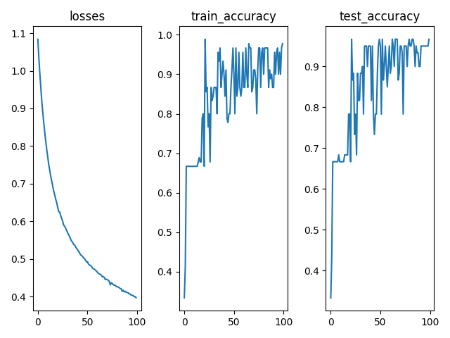
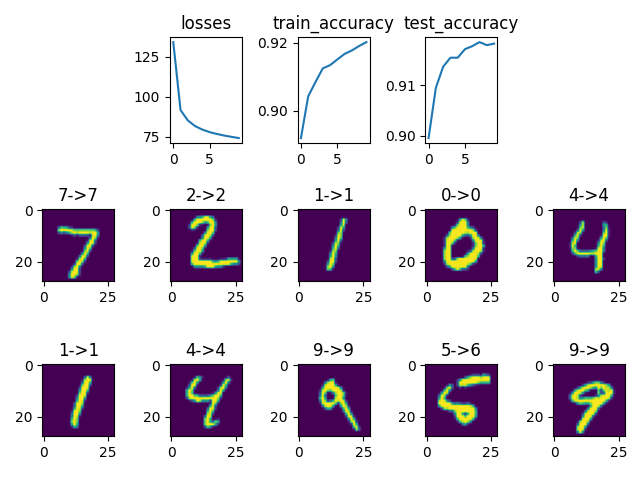

# L9 编程作业
    自实1901班 黄子昊 U201914549
## 1. IRIS数据集

### (a) OVO 多类分类器

+ OVO代码

```python
import csv
from lib.PLA import *


class OVO:
    def __init__(self, num_classes):
        self.num_classes = num_classes
        self.classes_list = self.__generate_list()
        self.PLA_models = [None for _ in range(len(self.classes_list))]
        self.flower_map = {
            "setosa": 0,
            "versicolor": 1,
            "virginica": 2
        }
        self.data_list_x = None
        self.data_list_y = None
        self.data_list_len = 0

    def train(self, data_path):
        self.data_list_x, self.data_list_y = self.__readcsv(data_path)
        self.data_list_len = len(self.data_list_x)

        for i in range(len(self.classes_list)):
            train_x, train_y, test_x, test_y = self.__generate_dataset(i)
            self.PLA_models[i] = PLA(train_x, train_y, test_x, test_y)
            self.PLA_models[i].train()
            self.PLA_models[i].test()

    def test(self, test_path):
        test_x, test_y = self.__readcsv(test_path)
        test_data_len = len(test_x)
        right = 0
        for i in range(test_data_len):
            votes = []
            for j in range(len(self.classes_list)):
                ret = self.PLA_models[j].test_pos_neg(test_x[i])
                if ret == 1:
                    votes.append(self.classes_list[j][0])
                else:
                    votes.append(self.classes_list[j][1])
            final_vote = max(votes, key=lambda v: votes.count(v))
            if final_vote == test_y[i]:
                right += 1
        print("Test accuracy: {}".format(right / test_data_len))
        return right / test_data_len

    def __generate_list(self):
        n = self.num_classes
        temp_list = []
        for i in range(n):
            for j in range(i + 1, n):
                temp_list.append([i, j])
        return temp_list

    def __readcsv(self, files):
        csvfile = open(files, 'r')
        plots = csv.reader(csvfile, delimiter=',')  # 按行读取CSV文件中的数据,每一行以空格作为分隔符，再将内容保存成列表的形式
        next(plots)  # 读取首行
        x = []
        y = []
        for row in plots:
            x.append([float(row[1]), float(row[2]), float(row[3]), float(row[4])])
            y.append(self.flower_map[row[5]])
        return x, y

    def __generate_dataset(self, index):
        pos, neg = self.classes_list[index]
        count_pos = 0
        count_neg = 0
        train_x = []
        train_y = []
        test_x = []
        test_y = []
        for i in range(self.data_list_len):
            item_x = self.data_list_x[i]
            item_y = self.data_list_y[i]
            if item_y == pos:
                if count_pos < 30:
                    count_pos += 1
                    train_x.append(item_x)
                    train_y.append(1)
                else:
                    test_x.append(item_x)
                    test_y.append(1)
            elif item_y == neg:
                if count_neg < 30:
                    count_neg += 1
                    train_x.append(item_x)
                    train_y.append(-1)
                else:
                    test_x.append(item_x)
                    test_y.append(-1)
        return train_x, train_y, test_x, test_y
```

+ 测试代码
  
```python
from lib.OVO import *


if __name__ == "__main__":
    my_OVO = OVO(3)
    my_OVO.train("../data/Iris/iris.csv")
    my_OVO.test("../data/Iris/iris_test.csv")
```

+ 分类结果
  
```
accuracy: 1.0
accuracy: 1.0
accuracy: 0.925
Test accuracy: 0.95
```

    三类分类器的正确率分别为100%,100%,92.5%

    综合起来，投票的正确率为95%

### (b) Softmax算法

+ Softmax代码

```python
def softmax(z):
    if len(z.shape) == 2:
        batch_size = z.shape[0]
        num_classes = z.shape[1]
        z_max = np.max(z.detach().numpy(), axis=1)
        z_max = torch.from_numpy(z_max).expand((num_classes, batch_size)).T
        z = torch.subtract(z, z_max)
        exp_z = torch.exp(z)
        sum_z = torch.sum(exp_z, axis=1)
        return torch.div(exp_z.T, sum_z).T
    else:
        z_max = np.max(z.detach().numpy())
        z_max = z_max * torch.ones_like(z)
        z = torch.subtract(z, z_max)
        exp_z = torch.exp(z)
        sum_z = torch.sum(exp_z)
        return torch.div(exp_z.T, sum_z)
```

+ 测试代码

```python
import torch.optim as optim
from torch.autograd import Variable
from lib.cross_entropy import *
from lib.softmax import *
import matplotlib.pyplot as plt
import csv

flower_map = {
    "setosa": 0,
    "versicolor": 1,
    "virginica": 2
}


def readcsv(files):
    csvfile = open(files, 'r')
    plots = csv.reader(csvfile, delimiter=',')  # 按行读取CSV文件中的数据,每一行以空格作为分隔符，再将内容保存成列表的形式
    next(plots)  # 读取首行
    x = []
    y = []
    for row in plots:
        x.append([float(row[1]), float(row[2]), float(row[3]), float(row[4])])
        y.append(flower_map[row[5]])
    return torch.tensor(x), torch.tensor(y)


train_x, train_y = readcsv("../data/Iris/iris_train.csv")
test_x, test_y = readcsv("../data/Iris/iris_test.csv")

# Training settings
batch_size = 1
input_size = 4
epochs = 100
num_classes = 3

w = torch.zeros((input_size, num_classes))
b = torch.zeros(num_classes)
w = Variable(torch.normal(w, 0.01))
w.requires_grad_(True)
b.requires_grad_(True)
optimizer = optim.SGD([w, b], lr=0.0008, momentum=0.0)  # 0.01 0.5

train_loader = torch.utils.data.DataLoader(dataset=torch.utils.data.TensorDataset(train_x, train_y),
                                           batch_size=batch_size,
                                           shuffle=True, drop_last=True)

test_loader = torch.utils.data.DataLoader(dataset=torch.utils.data.TensorDataset(test_x, test_y),
                                          batch_size=batch_size,
                                          shuffle=True, drop_last=True)


def train(train_dataloader):
    avg_loss = 0
    for batch_idx, (data, target) in enumerate(train_dataloader):
        data = data.view(batch_size, -1)
        optimizer.zero_grad()
        output = softmax(torch.add(torch.matmul(w.T, data.view(batch_size, -1).T).T, b))
        # loss
        loss = cross_entropy(output, target)
        avg_loss += loss
        loss.backward()
        # update
        optimizer.step()
    return avg_loss / len(train_dataloader)


def test(test_dataloader):
    correct = 0
    # 测试集
    for data, target in test_dataloader:
        data, target = Variable(data), Variable(target)
        data = data.view(-1)
        output = softmax(torch.add(torch.matmul(w.T, data.view(batch_size, -1).T).T, b))
        pred = np.argmax(output.detach().numpy(), axis=1)
        for i in range(batch_size):
            if pred[i] == target[i]:
                correct += 1
    return correct / len(test_dataloader.dataset)


losses = []
train_accuracy = []
test_accuracy = []
for epoch in range(epochs):
    losses.append(train(train_loader).item())
    train_accuracy.append(test(train_loader))
    test_accuracy.append(test(test_loader))
    print("epoch:{} loss:{} train_accuracy:{} test_accuracy:{}".format(epoch, losses[-1], train_accuracy[-1],
                                                                       test_accuracy[-1]))

plt.xlabel("epochs")
plt.subplot(131)
plt.title("losses")
plt.plot(losses)
plt.subplot(132)
plt.title("train_accuracy")
plt.plot(train_accuracy)
plt.subplot(133)
plt.title("test_accuracy")
plt.plot(test_accuracy)
plt.show()
```

+ 分类结果

```
    epoch:0 loss:1.0838847160339355 train_accuracy:0.3333333333333333 test_accuracy:0.3333333333333333
    epoch:1 loss:1.034549355506897 train_accuracy:0.4111111111111111 test_accuracy:0.43333333333333335
    epoch:2 loss:0.9924269914627075 train_accuracy:0.6666666666666666 test_accuracy:0.6666666666666666
    epoch:3 loss:0.954860508441925 train_accuracy:0.6666666666666666 test_accuracy:0.6666666666666666
    epoch:4 loss:0.9180014729499817 train_accuracy:0.6666666666666666 test_accuracy:0.6666666666666666
    epoch:5 loss:0.8887718915939331 train_accuracy:0.6666666666666666 test_accuracy:0.6666666666666666
    epoch:6 loss:0.8604950904846191 train_accuracy:0.6666666666666666 test_accuracy:0.6666666666666666
    epoch:7 loss:0.8355495929718018 train_accuracy:0.6666666666666666 test_accuracy:0.6666666666666666
    epoch:8 loss:0.8120320439338684 train_accuracy:0.6666666666666666 test_accuracy:0.6833333333333333
    epoch:9 loss:0.7898714542388916 train_accuracy:0.6666666666666666 test_accuracy:0.6666666666666666
    epoch:10 loss:0.7708485722541809 train_accuracy:0.6666666666666666 test_accuracy:0.6666666666666666
    epoch:11 loss:0.7499825954437256 train_accuracy:0.6666666666666666 test_accuracy:0.6666666666666666
    epoch:12 loss:0.7354769110679626 train_accuracy:0.6666666666666666 test_accuracy:0.6666666666666666
    epoch:13 loss:0.7195549607276917 train_accuracy:0.6666666666666666 test_accuracy:0.6666666666666666
    epoch:14 loss:0.7066971063613892 train_accuracy:0.6777777777777778 test_accuracy:0.6833333333333333
    epoch:15 loss:0.6938996315002441 train_accuracy:0.6888888888888889 test_accuracy:0.6833333333333333
    epoch:16 loss:0.6806557774543762 train_accuracy:0.6777777777777778 test_accuracy:0.6833333333333333
    epoch:17 loss:0.6697708368301392 train_accuracy:0.6777777777777778 test_accuracy:0.6833333333333333
    epoch:18 loss:0.6591066718101501 train_accuracy:0.7888888888888889 test_accuracy:0.7833333333333333
    epoch:19 loss:0.6496032476425171 train_accuracy:0.8 test_accuracy:0.7833333333333333
    epoch:20 loss:0.6370895504951477 train_accuracy:0.6666666666666666 test_accuracy:0.6666666666666666
    epoch:21 loss:0.6256192326545715 train_accuracy:0.9888888888888889 test_accuracy:0.9666666666666667
    epoch:22 loss:0.6248468160629272 train_accuracy:0.8555555555555555 test_accuracy:0.8666666666666667
    epoch:23 loss:0.6152812242507935 train_accuracy:0.8666666666666667 test_accuracy:0.8833333333333333
    epoch:24 loss:0.6079961657524109 train_accuracy:0.7666666666666667 test_accuracy:0.7333333333333333
    epoch:25 loss:0.600746214389801 train_accuracy:0.8 test_accuracy:0.7833333333333333
    epoch:26 loss:0.5901737809181213 train_accuracy:0.6777777777777778 test_accuracy:0.6833333333333333
    epoch:27 loss:0.5872409343719482 train_accuracy:0.8666666666666667 test_accuracy:0.8833333333333333
    epoch:28 loss:0.5819018483161926 train_accuracy:0.8333333333333334 test_accuracy:0.8166666666666667
    epoch:29 loss:0.5759016871452332 train_accuracy:0.8444444444444444 test_accuracy:0.8166666666666667
    epoch:30 loss:0.5695996880531311 train_accuracy:0.8666666666666667 test_accuracy:0.8833333333333333
    epoch:31 loss:0.5645738840103149 train_accuracy:0.8666666666666667 test_accuracy:0.8833333333333333
    epoch:32 loss:0.5597427487373352 train_accuracy:0.8666666666666667 test_accuracy:0.9
    epoch:33 loss:0.5528852343559265 train_accuracy:0.8 test_accuracy:0.7833333333333333
    epoch:34 loss:0.547636866569519 train_accuracy:0.9555555555555556 test_accuracy:0.95
    epoch:35 loss:0.5445469617843628 train_accuracy:0.9333333333333333 test_accuracy:0.95
    epoch:36 loss:0.5388327836990356 train_accuracy:0.9666666666666667 test_accuracy:0.95
    epoch:37 loss:0.5374061465263367 train_accuracy:0.8666666666666667 test_accuracy:0.9
    epoch:38 loss:0.5326687693595886 train_accuracy:0.9 test_accuracy:0.95
    epoch:39 loss:0.5282666683197021 train_accuracy:0.9333333333333333 test_accuracy:0.95
    epoch:40 loss:0.5247040390968323 train_accuracy:0.9 test_accuracy:0.95
    epoch:41 loss:0.5207914710044861 train_accuracy:0.8444444444444444 test_accuracy:0.8166666666666667
    epoch:42 loss:0.5167240500450134 train_accuracy:0.9111111111111111 test_accuracy:0.95
    epoch:43 loss:0.5112304091453552 train_accuracy:0.7888888888888889 test_accuracy:0.7833333333333333
    epoch:44 loss:0.5088492035865784 train_accuracy:0.7777777777777778 test_accuracy:0.7333333333333333
    epoch:45 loss:0.5073824524879456 train_accuracy:0.8 test_accuracy:0.7833333333333333
    epoch:46 loss:0.5030430555343628 train_accuracy:0.8 test_accuracy:0.7833333333333333
    epoch:47 loss:0.5014767646789551 train_accuracy:0.8666666666666667 test_accuracy:0.8833333333333333
    epoch:48 loss:0.49675971269607544 train_accuracy:0.9111111111111111 test_accuracy:0.95
    epoch:49 loss:0.49231722950935364 train_accuracy:0.9666666666666667 test_accuracy:0.9666666666666667
    epoch:50 loss:0.49277928471565247 train_accuracy:0.9 test_accuracy:0.95
    epoch:51 loss:0.48670831322669983 train_accuracy:0.8 test_accuracy:0.7833333333333333
    epoch:52 loss:0.4843657910823822 train_accuracy:0.9666666666666667 test_accuracy:0.9666666666666667
    epoch:53 loss:0.4826996326446533 train_accuracy:0.8444444444444444 test_accuracy:0.8666666666666667
    epoch:54 loss:0.48071739077568054 train_accuracy:0.8666666666666667 test_accuracy:0.9
    epoch:55 loss:0.4759328067302704 train_accuracy:0.9555555555555556 test_accuracy:0.95
    epoch:56 loss:0.4741203188896179 train_accuracy:0.8666666666666667 test_accuracy:0.9
    epoch:57 loss:0.4728783369064331 train_accuracy:0.8444444444444444 test_accuracy:0.85
    epoch:58 loss:0.4705769717693329 train_accuracy:0.8666666666666667 test_accuracy:0.9
    epoch:59 loss:0.4678992033004761 train_accuracy:0.9555555555555556 test_accuracy:0.95
    epoch:60 loss:0.465035080909729 train_accuracy:0.8666666666666667 test_accuracy:0.8833333333333333
    epoch:61 loss:0.4620133340358734 train_accuracy:0.8666666666666667 test_accuracy:0.9
    epoch:62 loss:0.460335373878479 train_accuracy:0.9666666666666667 test_accuracy:0.9666666666666667
    epoch:63 loss:0.45885801315307617 train_accuracy:0.9 test_accuracy:0.95
    epoch:64 loss:0.4573899209499359 train_accuracy:0.8666666666666667 test_accuracy:0.9
    epoch:65 loss:0.45268839597702026 train_accuracy:0.9777777777777777 test_accuracy:0.9666666666666667
    epoch:66 loss:0.45334985852241516 train_accuracy:0.9666666666666667 test_accuracy:0.9666666666666667
    epoch:67 loss:0.45084863901138306 train_accuracy:0.9666666666666667 test_accuracy:0.9666666666666667
    epoch:68 loss:0.4453447163105011 train_accuracy:0.8555555555555555 test_accuracy:0.8666666666666667
    epoch:69 loss:0.4463229775428772 train_accuracy:0.8666666666666667 test_accuracy:0.8833333333333333
    epoch:70 loss:0.4450416564941406 train_accuracy:0.9111111111111111 test_accuracy:0.95
    epoch:71 loss:0.4434727132320404 train_accuracy:0.9111111111111111 test_accuracy:0.95
    epoch:72 loss:0.4403753876686096 train_accuracy:0.8888888888888888 test_accuracy:0.9333333333333333
    epoch:73 loss:0.43128466606140137 train_accuracy:0.8 test_accuracy:0.7833333333333333
    epoch:74 loss:0.4370000958442688 train_accuracy:0.9111111111111111 test_accuracy:0.95
    epoch:75 loss:0.43519923090934753 train_accuracy:0.9666666666666667 test_accuracy:0.95
    epoch:76 loss:0.4319743812084198 train_accuracy:0.9666666666666667 test_accuracy:0.95
    epoch:77 loss:0.43037521839141846 train_accuracy:0.8666666666666667 test_accuracy:0.9
    epoch:78 loss:0.43053537607192993 train_accuracy:0.9555555555555556 test_accuracy:0.95
    epoch:79 loss:0.4269276559352875 train_accuracy:0.9666666666666667 test_accuracy:0.9666666666666667
    epoch:80 loss:0.4266800284385681 train_accuracy:0.9 test_accuracy:0.95
    epoch:81 loss:0.42516249418258667 train_accuracy:0.9666666666666667 test_accuracy:0.95
    epoch:82 loss:0.4240737557411194 train_accuracy:0.9666666666666667 test_accuracy:0.9666666666666667
    epoch:83 loss:0.42147859930992126 train_accuracy:0.9666666666666667 test_accuracy:0.9666666666666667
    epoch:84 loss:0.42091286182403564 train_accuracy:0.9666666666666667 test_accuracy:0.95
    epoch:85 loss:0.41429510712623596 train_accuracy:0.8666666666666667 test_accuracy:0.9
    epoch:86 loss:0.4170967638492584 train_accuracy:0.9111111111111111 test_accuracy:0.95
    epoch:87 loss:0.41285213828086853 train_accuracy:0.8888888888888888 test_accuracy:0.9333333333333333
    epoch:88 loss:0.4144262969493866 train_accuracy:0.9 test_accuracy:0.9333333333333333
    epoch:89 loss:0.41183021664619446 train_accuracy:0.8666666666666667 test_accuracy:0.9
    epoch:90 loss:0.4112379252910614 train_accuracy:0.8666666666666667 test_accuracy:0.9
    epoch:91 loss:0.4104776084423065 train_accuracy:0.9555555555555556 test_accuracy:0.95
    epoch:92 loss:0.40717294812202454 train_accuracy:0.9 test_accuracy:0.95
    epoch:93 loss:0.4072107970714569 train_accuracy:0.9555555555555556 test_accuracy:0.95
    epoch:94 loss:0.40434378385543823 train_accuracy:0.9666666666666667 test_accuracy:0.95
    epoch:95 loss:0.40339401364326477 train_accuracy:0.9 test_accuracy:0.95
    epoch:96 loss:0.4033943712711334 train_accuracy:0.9555555555555556 test_accuracy:0.95
    epoch:97 loss:0.40004870295524597 train_accuracy:0.9 test_accuracy:0.95
    epoch:98 loss:0.4002430737018585 train_accuracy:0.9666666666666667 test_accuracy:0.95
    epoch:99 loss:0.3969535827636719 train_accuracy:0.9777777777777777 test_accuracy:0.9666666666666667
```



    最终Softmax算法的正确率达97%左右，略高于OVO算法
    
## 2. MNIST数据集

+ 测试代码

```python
import numpy as np
import torch.optim as optim
from torchvision import datasets, transforms
from torch.autograd import Variable
from lib.cross_entropy import *
from lib.softmax import *
import matplotlib.pyplot as plt

# Training settings
batch_size = 256
input_size = 28 * 28
epochs = 10
num_classes = 10

# MNIST Dataset
train_dataset = datasets.MNIST(root='../data/',
                               train=True,
                               transform=transforms.Compose([transforms.Resize((28, 28)), transforms.ToTensor()]),
                               download=True)

test_dataset = datasets.MNIST(root='../data/',
                              train=False,
                              transform=transforms.Compose([transforms.Resize((28, 28)), transforms.ToTensor()]))

# Data Loader (Input Pipeline)
train_loader = torch.utils.data.DataLoader(dataset=train_dataset,
                                           batch_size=batch_size,
                                           shuffle=True, drop_last=True)

test_loader = torch.utils.data.DataLoader(dataset=test_dataset,
                                          batch_size=batch_size,
                                          shuffle=True, drop_last=True)

w = torch.zeros((input_size, num_classes))
b = torch.zeros(num_classes)
w = Variable(torch.normal(w, 0.01))
w.requires_grad_(True)
b.requires_grad_(True)
optimizer = optim.SGD([w, b], lr=0.001, momentum=0.1)  # 0.01 0.5


def train(train_dataloader):
    avg_loss = 0
    for batch_idx, (data, target) in enumerate(train_dataloader):
        data = data.view(batch_size, -1)
        optimizer.zero_grad()
        output = softmax(torch.add(torch.matmul(w.T, data.view(batch_size, -1).T).T, b))
        # loss
        loss = cross_entropy(output, target)
        avg_loss += loss
        loss.backward()
        # update
        optimizer.step()
    return avg_loss / len(train_dataloader)


def test(test_dataloader):
    correct = 0
    # 测试集
    for data, target in test_dataloader:
        data, target = Variable(data), Variable(target)
        data = data.view(-1)
        output = softmax(torch.add(torch.matmul(w.T, data.view(batch_size, -1).T).T, b))
        pred = np.argmax(output.detach().numpy(), axis=1)
        for i in range(batch_size):
            if pred[i] == target[i]:
                correct += 1
    return correct / len(test_dataloader.dataset)


losses = []
train_accuracy = []
test_accuracy = []
for epoch in range(epochs):
    losses.append(train(train_loader).item())
    train_accuracy.append(test(train_loader))
    test_accuracy.append(test(test_loader))
    print("epoch:{} loss:{} train_accuracy:{} test_accuracy:{}".format(epoch, losses[-1], train_accuracy[-1],
                                                                       test_accuracy[-1]))

plt.xlabel("epochs")
plt.subplot(3, 5, 2)
plt.title("losses")
plt.plot(losses)
plt.subplot(3, 5, 3)
plt.title("train_accuracy")
plt.plot(train_accuracy)
plt.subplot(3, 5, 4)
plt.title("test_accuracy")
plt.plot(test_accuracy)
with torch.no_grad():
    for i in range(10):
        data, target = test_dataset.__getitem__(i)
        pred = np.argmax(softmax(torch.add(torch.matmul(w.T, data.view(-1)).T, b)))
        plt.subplot(3, 5, i + 6)
        plt.title("{}->{}".format(target, pred))
        plt.imshow(data.view(28, 28))
plt.show()
```

+ 分类结果


